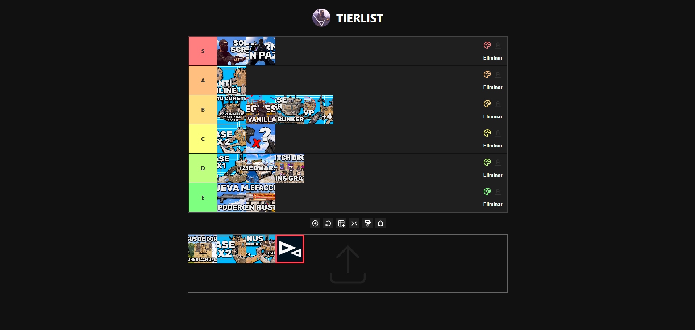

# SCR98-TIERLIST

</img>

## Descripción

La aplicación **SCR98 TIERLIST** permite crear y gestionar listas de niveles (tier lists) mediante la carga y organización de imágenes. Puedes arrastrar y soltar imágenes en diferentes filas, cambiar el color de fondo y del texto, y ajustar el estilo de las imágenes.

## Características

- **Cargar imágenes**: Puedes subir imágenes desde tu dispositivo o arrastrarlas y soltarlas directamente en la sección de items.
- **Arrastrar y soltar**: Organiza las imágenes arrastrándolas y soltándolas en diferentes filas.
- **Colores personalizados**: Cambia el color de fondo y del texto de cada fila.
- **Agregar y eliminar filas**: Añade nuevas filas a la lista o elimina las existentes.
- **Restablecer posiciones**: Restablece la posición original de las imágenes.
- **Alternar ajuste de imagen**: Alterna entre "cubrir" y "contener" para ajustar las imágenes a las filas.

## Uso

1. **Descargar y Abrir la Aplicación**
   - **Descargar el archivo HTML**: Descarga el archivo `scr98-tierlist.html` desde el repositorio.
   - **Abrir el archivo**: Haz doble clic en el archivo descargado para abrirlo en tu navegador web. La aplicación debería cargarse automáticamente.

2. **Agregar Imágenes**
   - **Desde el dispositivo**: Haz clic en el ícono de subir imágenes (o usa el input de archivo oculto) para seleccionar imágenes desde tu dispositivo.
   - **Arrastrar y soltar**: Arrastra imágenes desde tu escritorio y suéltalas en la sección de items.

3. **Organizar Imágenes**
   - Arrastra las imágenes desde la sección de items y suéltalas en las filas de la lista para organizarlas según tu preferencia.

4. **Configurar Filas**
   - **Cambiar color de fondo**: Usa el selector de color en la parte inferior para cambiar el color de fondo de las imágenes.
   - **Cambiar color del texto**: Cada fila tiene un color picker para cambiar el color del texto en la etiqueta de la fila.
   - **Agregar una nueva fila**: Haz clic en el botón "Añadir fila" para crear una nueva fila en la lista.
   - **Eliminar una fila**: Usa el botón de eliminar en la caja de opciones de cada fila para eliminarla.

5. **Restablecer y Alternar**
   - **Restablecer posiciones**: Haz clic en el botón de reinicio para devolver todas las imágenes a la sección de items y restablecer sus posiciones.
   - **Alternar ajuste de imagen**: Usa el botón de alternar ajuste para cambiar entre "cubrir" y "contener" las imágenes.

6. **Ajustar la transparencia del fondo**
   - **Hacer fondo transparente**: Haz clic en el botón de fondo transparente para hacer el fondo de las imágenes transparente.
   - **Restaurar color de fondo**: Usa el mismo botón para restaurar el color de fondo original.

## Requisitos

- Navegador web moderno con soporte para HTML5 y CSS3.
- JavaScript habilitado en el navegador.

## Contribuciones

Si deseas contribuir al proyecto, por favor realiza un fork del repositorio, haz tus cambios y envía una solicitud de extracción (pull request).

## Licencia

Este proyecto está licenciado bajo la [MIT License](LICENSE).

